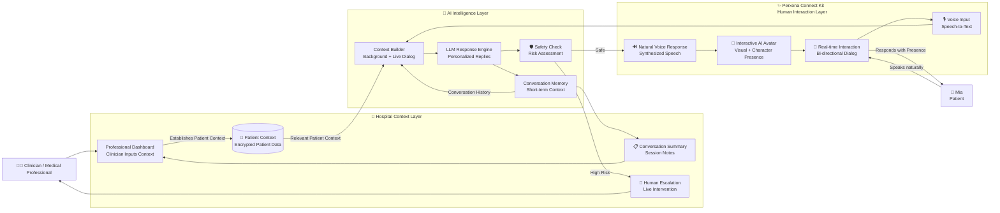

# Perxona Connect Kit Research

This repository contains English research notes for building with Perxona Connect Kit. It documents the browser Presenter, Connect REST API, supported connection patterns, Motion Browser, Motion IDs, and custom VRM constraints.

Start with the [documentation index](docs/perxona-connect-kit/README.md).

## Documentation

- [Presenter SDK reference](docs/perxona-connect-kit/01-presenter-sdk.md)
- [Connect REST API reference](docs/perxona-connect-kit/02-connect-api.md)
- [Connection and integration patterns](docs/perxona-connect-kit/03-integration-patterns.md)
- [Motion Browser, Motion IDs, and custom VRM](docs/perxona-connect-kit/04-motion-browser-and-vrm.md)
- [Selecting Avatar, Scene, Voice, and Motion IDs](docs/perxona-connect-kit/05-selecting-catalog-ids.md)

Research was last verified on 2026-08-29. Recheck the official sources before implementation because APIs, access restrictions, pricing, and preview behavior may change.

## Applications

Both applications live in [`app/`](app/) and share the same Perxona modules.

```bash
cd app
npm install
npm run dev
```

### Medical Companion — `/`

Medical Companion is an AI virtual companionship system providing context-aware support for patients, guided by medical professionals.

**The Challenge:** Clinicians cannot be with patients 24/7. When a patient feels lonely or anxious late at night, they are often alone.
**The Solution:** An AI extends the context and care established by professionals.

#### Why Perxona?

By utilizing Perxona Connect Kit, we transform standard text-based AI chat into a human-centered interaction. For patients facing loneliness or grief, typing into an empty chat box creates friction. Perxona removes this barrier: the patient doesn't need to learn an interface—they just look at the companion and speak.

**Chatbots give the patient an answer. Perxona gives the patient an interaction.** Perxona Connect Kit turns the AI from a "question answering model" into a "companion the patient is willing to interact with" by providing real presence.

#### System Architecture

Rather than treating the avatar as an output device at the end of an LLM, our architecture positions Perxona Connect Kit as the core **Human Interaction Layer** that makes the experience possible.



#### Implementation details

A three-screen flow on one vertical rail: a landing page, a clinician console,
and the patient-facing session. Advancing slides the rail rather than changing
routes, so the console rises out of the landing page.

The console turns a written care plan into the companion's standing
instructions. It reads and writes one `Prescription` object whose shape matches
the agreed care-plan JSON exactly, so no translation step sits between the form
and the model.

| Area                                          | Module                          |
| --------------------------------------------- | ------------------------------- |
| Care-plan shape and form option lists         | `app/lib/companion/types.ts`    |
| Hardcoded demo plan, Avatar and Scene presets | `app/lib/companion/defaults.ts` |
| Care plan rendered into a system prompt       | `app/lib/companion/prompt.ts`   |
| Escalation keyword scan and boundary filter   | `app/lib/companion/safety.ts`   |
| Reply generation, with a rule-based stand-in  | `app/lib/companion/brain.ts`    |

Hard boundaries are enforced twice: written into the system prompt, and checked
again against the reply before it reaches `present()`. Escalation keywords are
scanned locally so a flag is raised even when the model misses one.

`app/lib/companion/brain.ts` ships a rule-based responder so the flow is
demonstrable with no backend. Replace `localReply` with a call to your own
server route — the prompt is already assembled and the return shape matches the
JSON the model is asked to emit.

Avatar, Scene, and Voice IDs come from the ignored `app/.env.local`. Without
them the session runs in rehearsal mode on the browser's own voice, which is
also the fallback when `resumeAudioPlayback()` has no live target.

### Presenter reference demo — `/studio`

The single-screen Presenter demo. It works immediately in browser-voice demo
mode. To use a live Perxona Avatar, open **Setup** and enter a
domain-restricted Publishable key, then either load the organization catalog or
type the Avatar, Scene, and Voice IDs directly.

It exercises the full documented Presenter surface:

| Area                                                 | Module                                     |
| ---------------------------------------------------- | ------------------------------------------ |
| Element types, emotions, events, catalog records     | `app/lib/perxona/types.ts`                 |
| Regional runtime loader, result codes, motion markup | `app/lib/perxona/presenter.ts`             |
| Paginated Avatar, Scene, Voice, and Motion reads     | `app/lib/perxona/catalog.ts`               |
| Element ownership, event wiring, every 0.3.0 method  | `app/lib/perxona/use-presenter.ts`         |
| Push-to-talk microphone via the Web Speech API       | `app/lib/speech/use-speech-recognition.ts` |

Motion markup is validated against the selected Avatar's motion catalog before
it reaches `present()`, so an unknown Motion ID is stripped rather than sent.

The demo keeps the Publishable key in memory only. Do not use a Secret key in the browser.

For local Vite defaults, create an ignored `app/.env.local` file with the
organization-specific values:

```dotenv
VITE_PERXONA_CONNECT_PUBLISHABLE_KEY=pxc_...
VITE_PERXONA_AVATAR_ID=your-avatar-id
VITE_PERXONA_SCENE_ID=your-scene-id
VITE_PERXONA_VOICE_ID=your-voice-id
```
